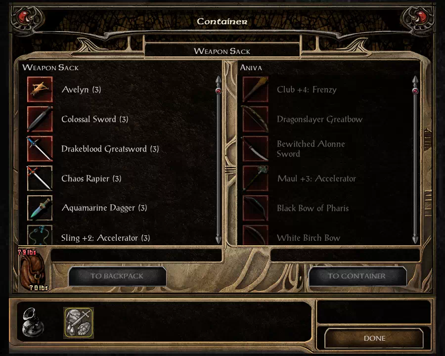
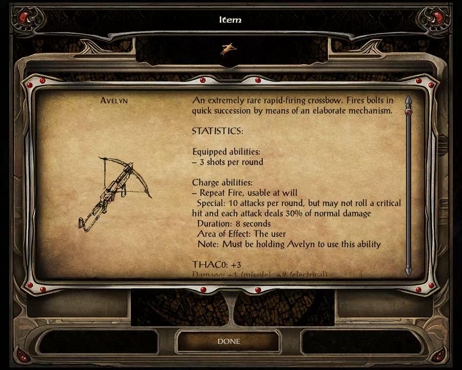
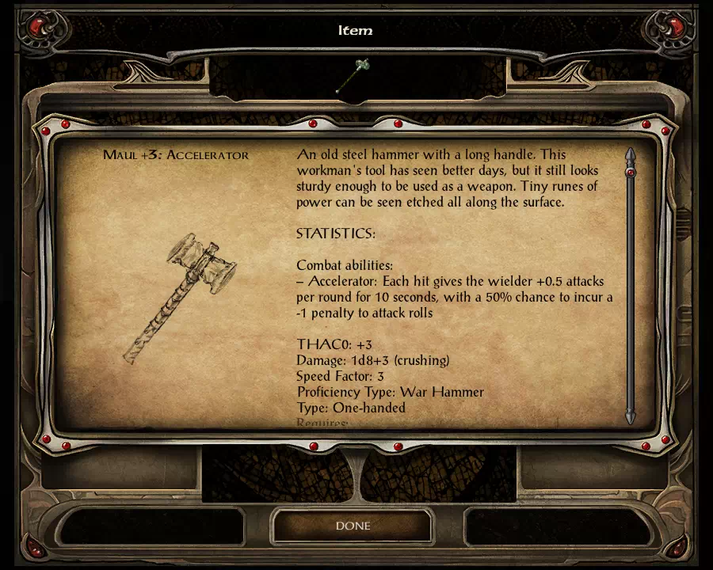
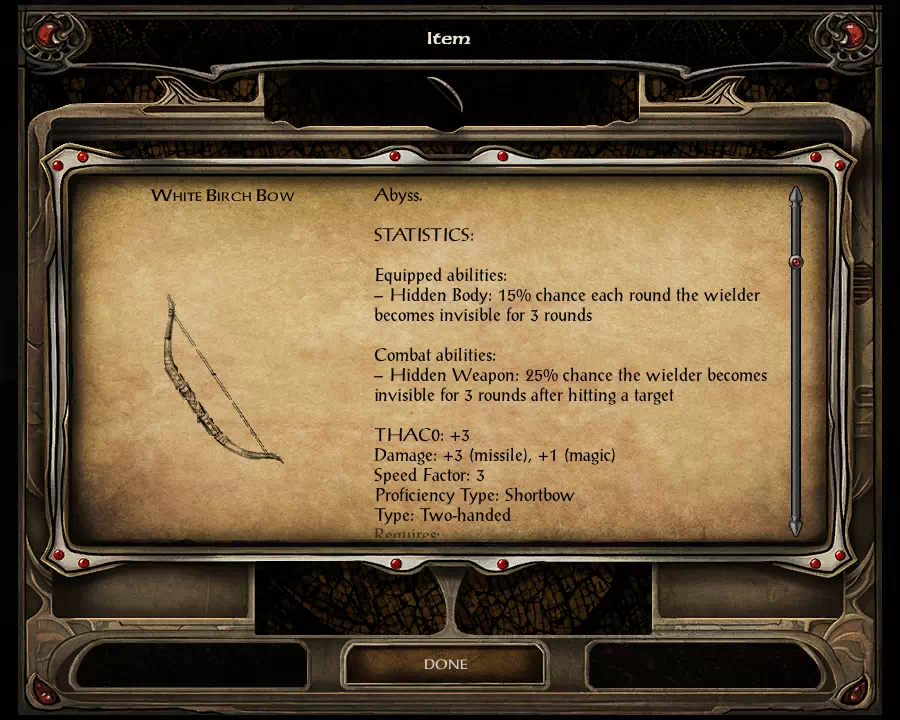
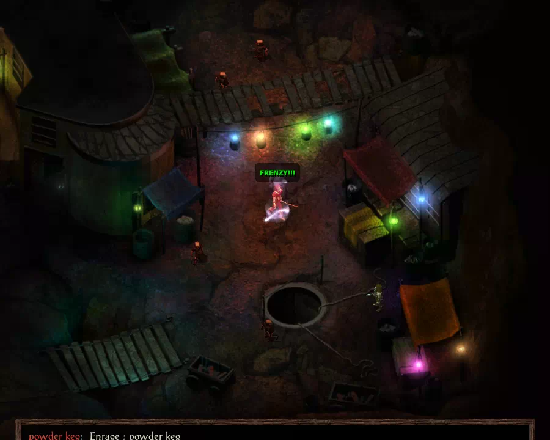
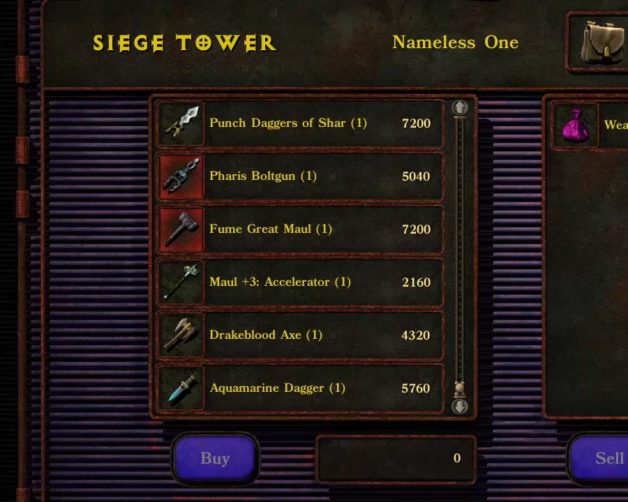
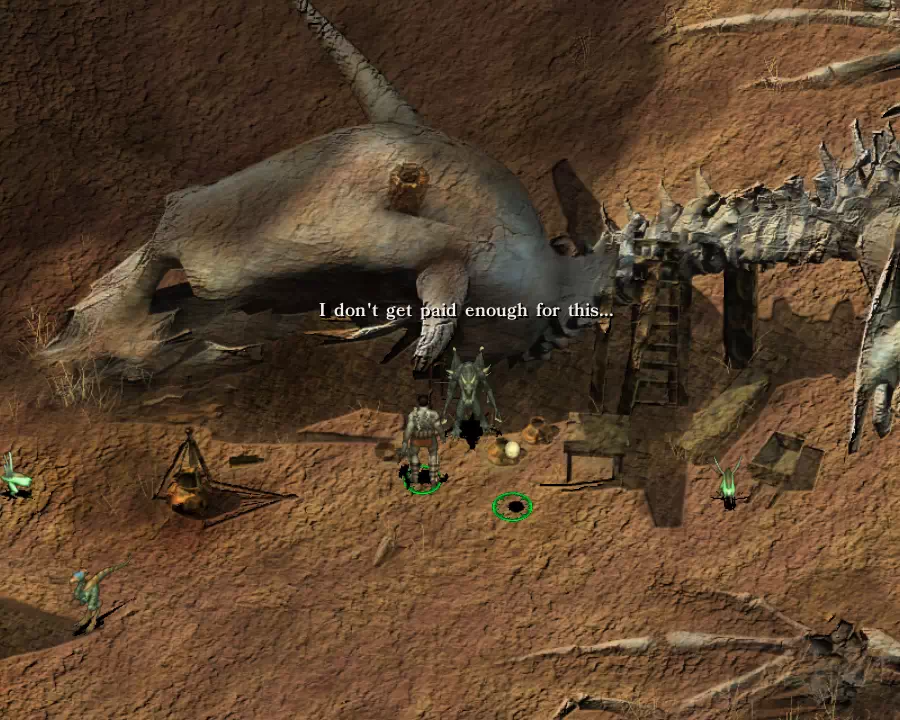

# D2-Weapon (Souls-inspired Weapon Pack)
Download: https://github.com/D2-mods/D2-Weapon/releases  
Installs on: BG:EE, BG2:EE, IWD:EE, PST:EE, EET

--

Overview:
-

This is a mod for Infinity Engine games. Currently adds 15 weapons, many of them loosely based on weapons from FromSoft's Souls games. All items are purchased from various sellers. Some have more standard abilities, while others have more extreme advantages and disadvantages. 

There's also an optional NPC merchant component that adds a merchant to multiple locations in each game. The merchant gives access to 3 stores from each game with items from this mod. More info below.

--

**v3.0 update:**
- Added PSTEE support. More info below.
- Overhauled merchant component. (now supports all EEs)
- Revised several weapons. (Chaos Rapier, Avelyn, etc.)
- Some weapon abilities now require you to be holding the weapon (effects end if not held).
- Major changes internally to the installer.
- Major changes structurally to many item/spell effects.

--

<details>
  <summary>Preview:</summary>







</details>

--

Components:
-
1. Main component (install items)
2. Add damage to bows (recommended for IWD:EE)
3. NPC merchant (does not require main component)

--

**Additional info:**
- This mod is safe to install before or after usability tweaks or proficiency overhauls. (It's still recommended to follow normal install order guidelines. This is just in case you install after tweaks by mistake.)
- PSTEE: Standard install includes damage and price adjustments (no separate installer options).
- "Dev mode" is just the standard install, but you start with a bag with all items.

--

**BGEE/SoD notes (v3.0):**
- 4 items are obtainable (the rest are still installed).
- Now also compatible with NPC merchant component (gives access to 3 SoD stores).

**PSTEE notes (v3.0):**
- All weapons use a PST proficiency and animation (no animation if "Fist" type).
- Item text is changed to the PST style. Some item names are changed to fit PST weapon types.
- To use item abilities, click "Use" from the inventory, then choose the option to cast.
- For technical reasons (UI issues), ranged weapons use innate ammo instead of bolts.
- Some effects were removed for compatibility (ex. haste doesn't work in PST).
- Compatible with NPC merchant component (appears in 4 areas).

--

<details>
  <summary>Preview:</summary>



</details>

--

NPC merchant:
-
- BG1/SoD: Gives access to Kazzrem's store, Waizahb's store, and Nazramu's store.
- BG2: Gives access to Deidre's store, Joluv's store, and Ribald's special store.
- IWD: Gives access to Conlan's store, Lehland's store, and Nym's store.
- PST: Gives access to Emoric's store, Coaxmetal's store, and Keldor's store.

--

**More info (v3.0+):**
- Appears in 4-6 areas per game (most are later or difficult areas). There is one earlier location in each game, but you may need to advance the story before they offer store options.
- Some stores will require you to have accessed the store once before appearing as an option. In expansion areas, all stores are treated as having been visited.
- There are 3 possible merchants now. They give the same store options, but have different dialog. Every 1-2 days (200 turns), the merchant can change to a different one. It's randomized, so you can get the same one repeatedly.
- If the merchant disappears, it's just invisible (scripting stuff). It should reappear when you're out of visual range, or after a few turns.

--

<details>
  <summary>Preview:</summary>




</details>

--

Item list:
-

```
d2bow01 - Black Bow of Pharis
d2bow02 - Dragonslayer Greatbow
d2bow03 - White Birch Bow
d2bow04 - Avelyn
d2swd01 - Colossal Sword
d2swd02 - Fume Ultra Greatsword
d2swd03 - Chaos Rapier
d2swd04 - Drakeblood Greatsword
d2swd05 - Bewitched Alonne Sword
d2swd06 - Stone Greatsword
d2dag01 - Aquamarine Dagger
d2hal01 - Unbalanced Halberd
d2ham01 - Club +4: Frenzy
d2ham02 - Maul +3: Accelerator
d2eff01 - Sling +2: Accelerator
```

PSTEE note: Most have different names and icons for PST. The changed name will still be somewhat similar to the old one. (ex. Colossal Sword becomes Colossal Hammer).

--

Copyright info:
-

"D2-Weapon" is licensed under Creative Commons Attribution-ShareAlike 3.0 Unported ([CC BY-SA 3.0](https://creativecommons.org/licenses/by-sa/3.0/)). It uses modified images for the icon BAMs, taken from wikidot.com or Fandom.com, and which are shared under this license.

Note: Starting with v2.2, this mod no longer uses licensed images, edited or otherwise, except for files taken from Infinity Engine games.
